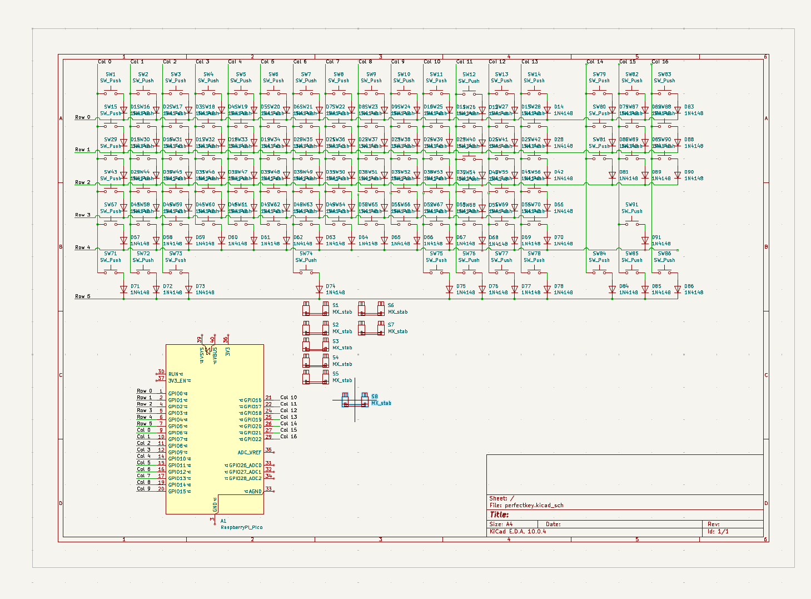
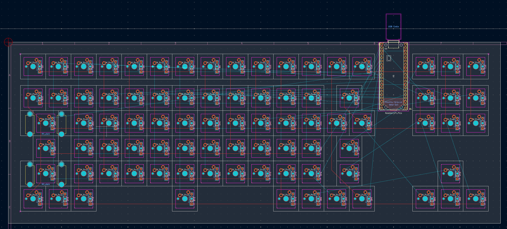
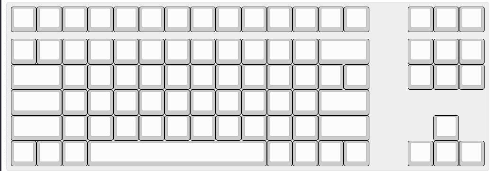
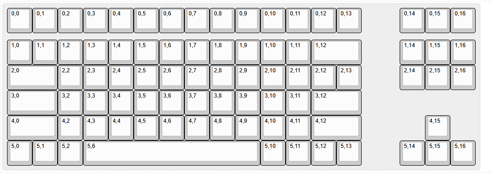
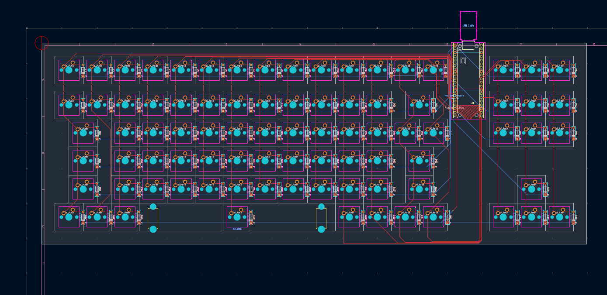
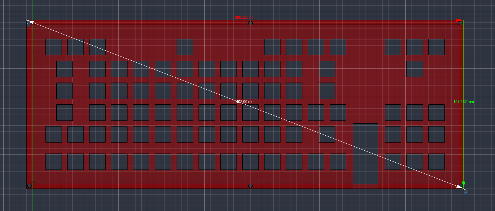
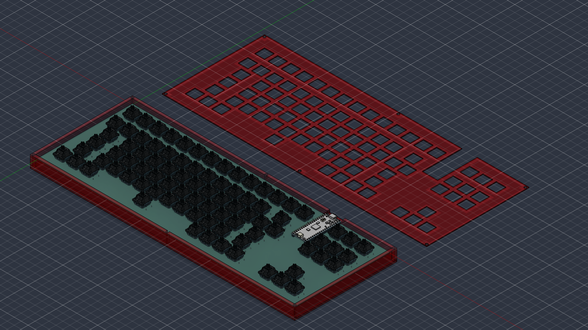
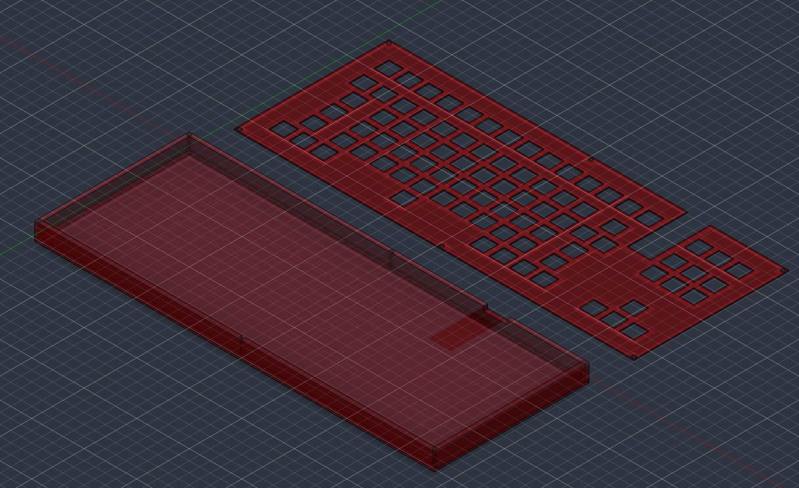

# Perfectionist Keyboard
A project following the [HackClub KEEB project tutorial](https://keeb.hackclub.com/docs), making a custom mechanical keyboard from scratch.

I have always been a perfectionist and I often find myself following the lines between the keys on my keyboard instead of doing my homework so I decided to make a keyboard with perfectly aligned keys.

## What it is
An ortholinear TKL keyboard, designed from scratch in KiCad. All mods are 2u, spacebar is 7u, board is about 350x165mm with a strip for the Pico, switches are on the normal 19.05mm grid, USB-C with a cutout in the case, just one stabilizer for the spacebar, because the footprints wouldn't fit directly above each other and it's not like the 2u keys will wobble enough to need a stabilizer :|

## Repo structure
- `kicad/` - schematic and PCB layout, Gerbers, drill files
- `case/` - case and plate files
- `photos/` - build photos for journal

## Build log

**2026-07-11 - Schematic:**
Read through the guide and designed the schematic. Switch matrix, diodes so it doesn't ghost, stabs, wired it all to the Pico.

**2026-07-14 - Started placing switches:**

**2026-07-15 - Switches were completely wrong:**
Got the kicad-kbplacer plugin to place the keys instead and made the layout in KLE.

**2026-07-16 - Numbering everything:**
Had to number all the keys in KLE because kbplacer wouldn't place them correctly without an index, renamed all the rows and columns so it would recognize them.

**2026-07-17 - Routing:**
Routing cables and rerouting until they fit.

**2026-07-18 - Diodes, PCB finished:**
Kbplacer put the diodes inside the courtyards of the switches and the cables were so tight around them. I couldn't move them, so I had to reroute first. PCB finished after that.

**2026-07-22 - Starting the case:**
Started designing the case, rage quit because of Onshape (can't expect much from browser based software), switched to Fusion.

**2026-07-23 - Case, mostly:**
Did most of the case but no space for screw holes.

**2026-07-24 - Case finished:**
Made the case bigger so the holes fit and made the top plate removable.

## Status
PCB and case design done, firmware next and them hoping and waiting for approval
